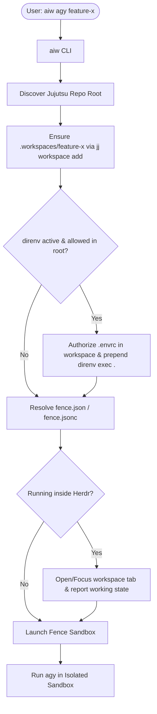

# AI Workspace (`aiw`)

> **An easy-to-use, opinionated tool for creating sandboxed AI workspaces.**

[](LICENSE)
[](https://www.rust-lang.org/)

**AI Workspace** (`aiw`) streamlines running autonomous AI coding agents (such as Google Antigravity / `agy`) in dedicated, secure, and isolated development environments. It pairs the flexibility of [Jujutsu (`jj`)](https://github.com/martinvonz/jj) workspaces with OS-level containment powered by [Fence](https://github.com/fencesandbox/fence), automatic [direnv](https://direnv.net/) environment propagation, and seamless [Herdr](https://github.com/herdr/herdr) multiplexer integration.

---

> [!IMPORTANT]
> **Disclaimer**: This is a personal project and does not represent the author's current or past employer.

---

## Why AI Workspace?

Running autonomous coding agents directly inside your primary workspace carries risks:
- Agents can accidentally touch uncommitted files or unrelated submodules.
- Broad disk and network permissions can lead to unexpected side effects or credential leakage.
- Prompting for every single tool invocation hampers agent autonomy and flow.

`aiw` solves this with an **opinionated, zero-friction workflow**:

1. **Jujutsu (`jj`) Workspaces**: Spawns isolated, lightweight working copies under `.workspaces/<workspace-name>`, keeping your main working tree pristine.
2. **Fence Sandbox Containment**: Executes the agent inside a [Bubblewrap](https://github.com/containers/bubblewrap)-based Linux sandbox with restricted filesystem paths and explicit domain allowlists.
3. **Safe Agent Autonomy**: Safely runs agents with permissions unlocked inside the container (`--dangerously-skip-permissions`), providing complete autonomous velocity while guaranteeing strict containment at the OS kernel level.
4. **Automated `direnv` Support**: Automatically discovers and authorizes `.envrc` in newly spawned workspaces if the root repository has direnv active and allowed, prepending `direnv exec .` inside the sandbox.
5. **Native `herdr` Integration**: If you run inside a [Herdr](https://github.com/herdr/herdr) terminal multiplexer session, `aiw` automatically creates workspace tabs, focuses them, and reports live agent states.

---

## How It Works



---

## Prerequisites

- **Linux** (required for Bubblewrap-based sandboxing)
- **[Jujutsu (`jj`)](https://github.com/martinvonz/jj)**: Version control system for workspace management
- **[Fence](https://github.com/fencesandbox/fence)**: Application sandbox utility
- **AI Agent CLI**: e.g., `agy` (Antigravity CLI)
- *(Optional)* **[direnv](https://direnv.net/)**: For directory-based environment variable management
- *(Optional)* **[Herdr](https://github.com/herdr/herdr)**: Terminal multiplexer with agent status reporting

---

## Installation

### From Source (Cargo)

Ensure you have Rust and Cargo installed (edition 2024 supported):

```bash
git clone https://github.com/<your-username>/aiw.git
cd aiw
cargo install --path .
```

### With Nix / Flakes

If using [Nix](https://nixos.org/):

```bash
# Enter development shell with all dependencies
nix develop

# Build the package
nix build

# Run directly
nix run github:<your-username>/aiw -- agy my-workspace --dry-run
```

---

## Usage

### 1. Launch an AI Workspace

To create (or resume) an isolated workspace and launch `agy` inside a sandbox:

```bash
aiw agy <workspace-name>
```

For example:
```bash
aiw agy feature-login
```
This command:
- Checks for an existing workspace named `feature-login` or creates `.workspaces/feature-login` via `jj workspace add`.
- Authorizes and activates `direnv` if active in the repository root.
- Wraps the agent inside `fence` using root or workspace settings.
- Automatically handles tab creation and agent reporting if running inside Herdr.

### 2. Dry Run Mode

To inspect the generated `fence` command without actually executing it, use `--dry-run`:

```bash
aiw agy feature-login --dry-run
```

Output example:
```text
fence --settings /path/to/repo/fence.json -- direnv exec . agy --dangerously-skip-permissions
```

### 3. Forward Arguments to the Agent

Pass additional flags to the underlying agent CLI after `--`:

```bash
aiw agy feature-login -- --model gemini-2.5-pro --verbose
```

### 4. Forget / Clean Up a Workspace

When work in a workspace is completed and merged, forget and delete it:

```bash
aiw forget <workspace-name>
```

This cleans up the Jujutsu workspace registration (`jj workspace forget`) and removes `.workspaces/<workspace-name>` from disk.

---

## Configuration

`aiw` supports configuration files placed at your repository root or within individual workspaces:

### `aiw.json`

Specifies tools and network permissions:

```json
{
  "tools": [
    "cargo",
    "rustc",
    "jj",
    "git"
  ],
  "default_tools": true,
  "network": true
}
```

- `tools`: Explicit list of binaries required by the agent.
- `default_tools`: When `true`, automatically includes standard Linux utility binaries (`grep`, `find`, `ls`, `cat`, `cp`, `mv`, `rm`, `mkdir`, `sh`, `bash`, `sed`, `awk`).
- `network`: Controls network access permissions.

### `fence.json` or `fence.jsonc`

Defines sandbox isolation boundaries. Place in your repo root or in `.workspaces/<workspace-name>/`:

```json
{
  "$schema": "https://raw.githubusercontent.com/fencesandbox/fence/main/docs/schema/fence.schema.json",
  "extends": "code",
  "network": {
    "allowLocalOutbound": false,
    "allowedDomains": [
      "*.googleapis.com",
      "*.google.com",
      "*.googleusercontent.com",
      "*.gstatic.com"
    ]
  },
  "filesystem": {
    "allowRead": [
      "/nix"
    ],
    "allowWrite": [
      ".",
      ".jj/**",
      ".git/**",
      "../../.jj/**",
      "../../.git/**",
      ".workspaces/**",
      "~/.gemini/**"
    ]
  }
}
```

---

## Multiplexer Integration (`Herdr`)

`aiw` features built-in support for the [Herdr](https://github.com/herdr/herdr) terminal multiplexer:
- **Automatic Tab Creation**: When executed outside the workspace tab, `aiw` opens a new tab labeled after the workspace and launches the sandbox inside it.
- **Agent Lifecycle Reporting**: Reports `working` state directly to Herdr via `herdr pane report-agent`.
- **In-Place Execution**: If already inside a tab named after the workspace, `aiw` executes directly in place without creating duplicate tabs.

---

## Contributing

Contributions, bug reports, and suggestions are welcome! Please feel free to open an issue or submit a pull request.

---

## License

This project is licensed under the [MIT License](LICENSE).

---

> [!NOTE]
> **Disclaimer**: This is a personal project and does not represent the author's current or past employer.
